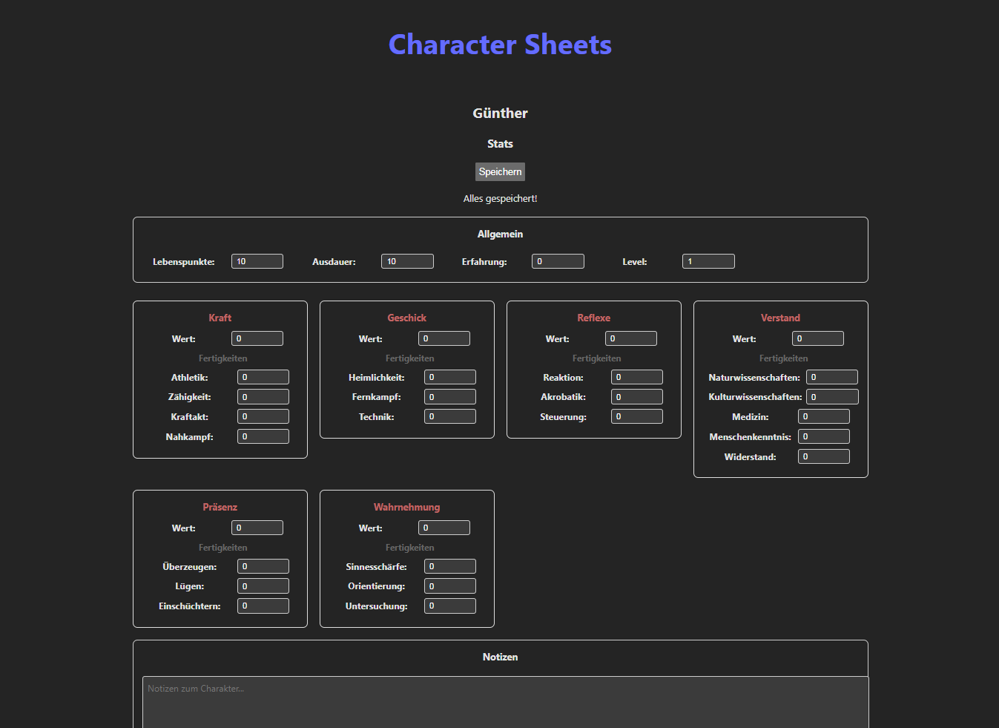

# Character Sheets Manager

A web-based character sheet management system for tabletop RPG (Pen & Paper) games with real-time collaboration support via Cloudflare Tunnel.

## Screenshot



## Features

- **Create & manage multiple characters** with detailed stats and attributes
- **Dynamic grid layout** - Stats automatically adjust to screen size without scrolling
- **Real-time editing** - Changes are tracked and saved to database
- **Notes & Inventory** - Multi-line text fields for character notes and items
- **Internet access** - Share with friends via Cloudflare Tunnel (optional)
- **Local hosting** - Self-hosted solution with no external dependencies

## Tech Stack

**Frontend:**

- React + TypeScript
- Vite (dev server & build tool)
- CSS Modules

**Backend:**

- PHP 8.x (built-in server)
- MySQL/MariaDB (via XAMPP)
- RESTful API

**Deployment:**

- Cloudflare Tunnel (for internet access)
- Local hosting

## How It Works

### Architecture

```
Users → Cloudflare Tunnel → Vite (Frontend) → PHP (Backend) → MySQL Database
```

All components run locally on your machine. Cloudflare Tunnel provides secure internet access without port forwarding.

### Data Structure

Characters contain:

- **General Stats:** Health, Stamina, Experience, Level
- **Attributes:** Six main attributes (Kraft, Geschick, Reflexe, Verstand, Präsenz, Wahrnehmung)
- **Skills:** Each attribute has 3-5 related skills
- **Notes & Items:** Free-text fields for additional information

## Quick Start

### Prerequisites

1. **XAMPP** - Install from https://www.apachefriends.org/
2. **PHP** - Add to PATH (comes with XAMPP)
3. **Node.js & npm** - Install from https://nodejs.org/
4. **cloudflared** (optional, for internet access) - Download from https://developers.cloudflare.com/cloudflare-one/connections/connect-networks/downloads/

### Installation

1. **Clone or download this repository**

2. **Set up the database:**
    - Start XAMPP (MySQL service)
    - Create database named `pnp` in phpMyAdmin
    - Import the database schema (if provided)

3. **Install frontend dependencies:**

    ```bash
    cd frontend
    npm install
    ```

4. **Configure backend:**
    - Edit `backend/config/database.php` if needed
    - Default settings work with standard XAMPP installation

### Usage

#### Option 1: Local Only

Run `start-local.bat` to start servers for local access only:

- Frontend: http://localhost:5173
- Backend: http://localhost:8000

#### Option 2: Internet Access (with Cloudflare)

1. Download `cloudflared.exe` and place it in the project root folder
2. Run `start.bat`
3. Look for the Cloudflare URL in the console (e.g., `https://xxx-xxx.trycloudflare.com`)
4. Share this URL with your friends

**Note:** The Cloudflare URL changes on every restart.

#### Stopping the Servers

Run `stop.bat` or close all terminal windows.

## Project Structure

```
CharacterSheets/
├── backend/
│   ├── config/          # Configuration files (DB, CORS, default stats)
│   ├── controllers/     # Business logic
│   ├── routes/          # API routing
│   └── index.php        # Entry point
├── frontend/
│   ├── src/
│   │   ├── components/  # React components
│   │   ├── services/    # API client
│   │   └── types/       # TypeScript types
│   ├── vite.config.ts   # Vite configuration
│   └── package.json
├── start.bat            # Start with Cloudflare Tunnel
├── start-local.bat      # Start without internet access
└── stop.bat             # Stop all servers
```

## API Endpoints

| Method | Endpoint                       | Description          |
| ------ | ------------------------------ | -------------------- |
| GET    | `/api?route=characters`        | Get all characters   |
| GET    | `/api?route=character&id={id}` | Get character by ID  |
| POST   | `/api?route=newCharacter`      | Create new character |
| POST   | `/api?route=character`         | Update character     |

## Configuration

### Frontend (vite.config.ts)

- Default port: 5173
- Proxy `/api` requests to backend (port 8000)
- Allows Cloudflare Tunnel hosts

### Backend (config/database.php)

- Host: localhost
- Database: pnp
- User: root
- Password: (empty - default XAMPP)

### CORS (config/cors.php)

- Allows all origins (for Cloudflare compatibility)
- Methods: GET, POST, PUT, DELETE, OPTIONS

## Security Notes

- This setup is intended for small groups of friends
- **No authentication** - anyone with the URL can access
- Database runs locally (not exposed to internet)
- Cloudflare URL is random and changes on restart
- For production use, implement proper authentication

## Troubleshooting

**"cloudflared is not installed"**

- Download from Cloudflare and place in project folder or add to PATH

**"PHP is not installed"**

- Install XAMPP and add PHP to system PATH

**"npm is not installed"**

- Install Node.js from nodejs.org

**"Database connection failed"**

- Start XAMPP MySQL service
- Verify database "pnp" exists
- Check credentials in `backend/config/database.php`

**Cloudflare URL doesn't work**

- Wait 30-60 seconds for tunnel to activate
- Restart servers with `stop.bat` then `start.bat`

## License

This project is provided as-is for personal use.

## Contributing

Feel free to fork and modify for your own campaigns!
